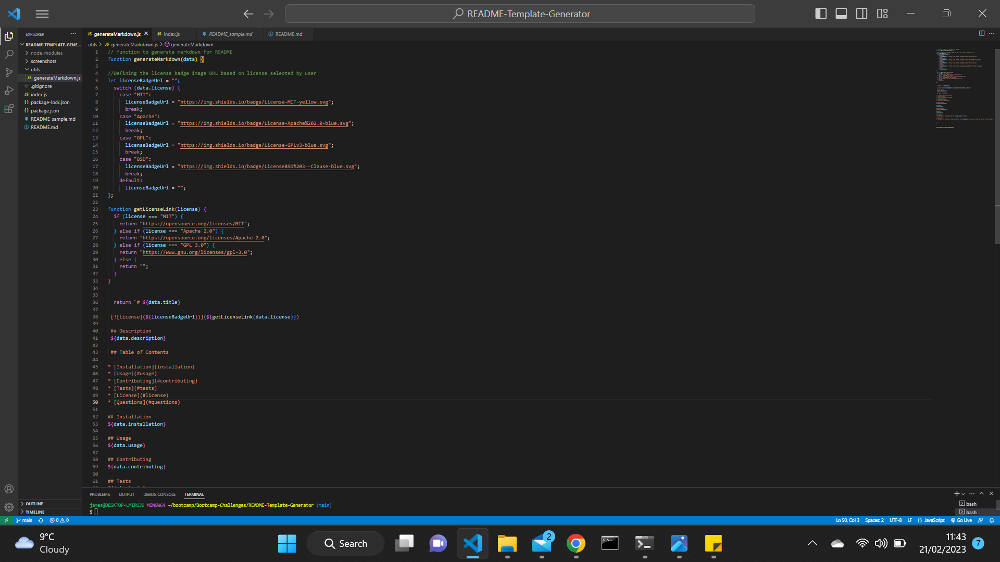
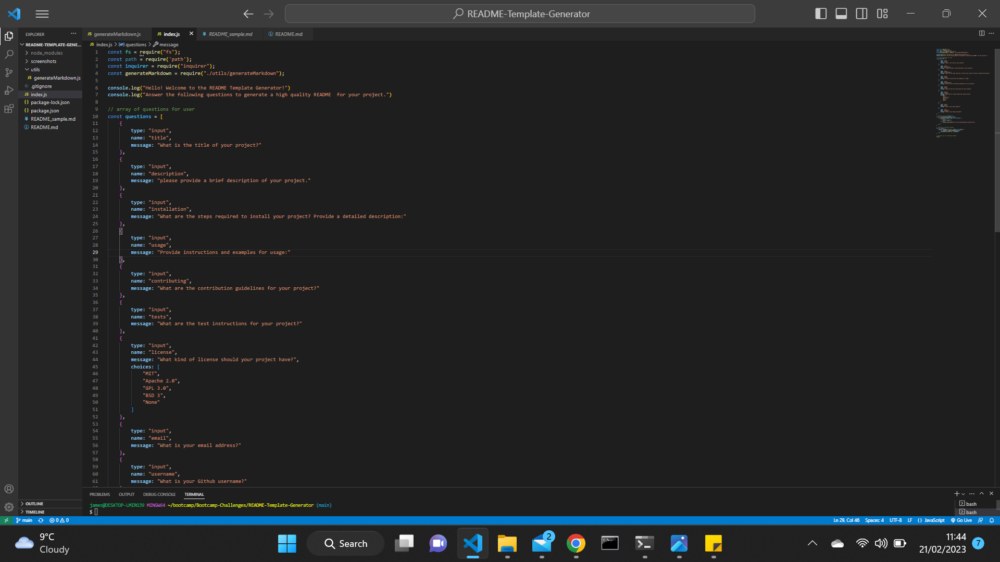
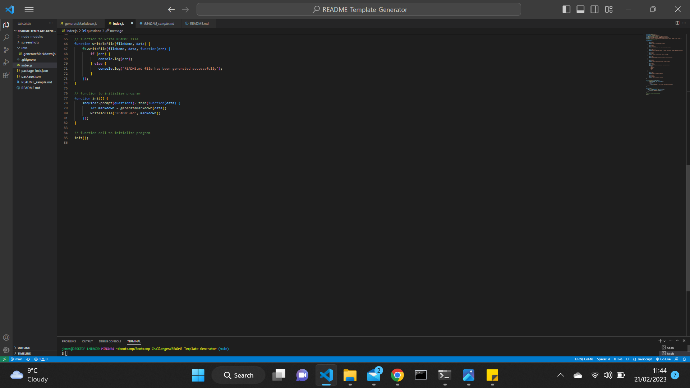
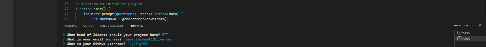
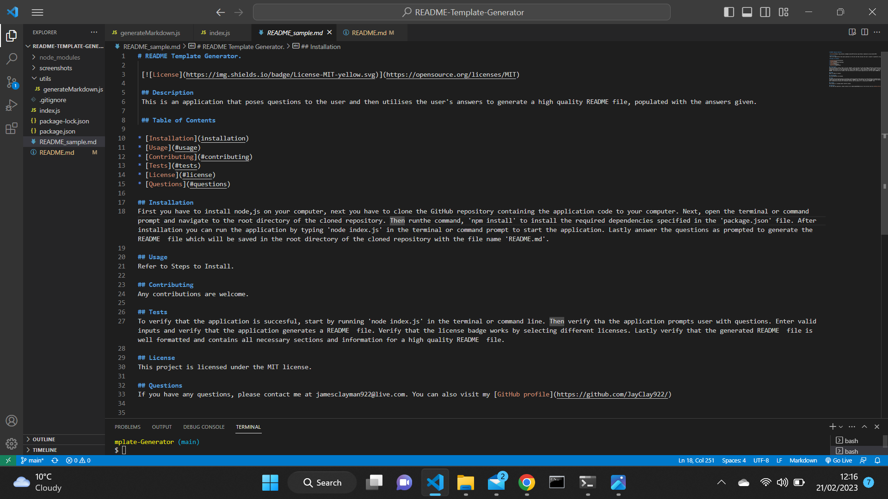
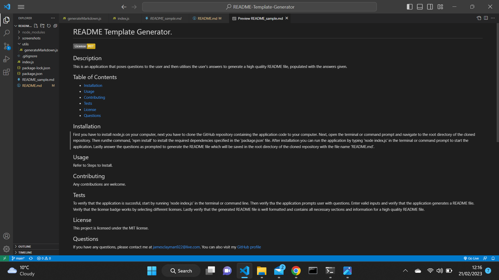

# README Template Generator

## Project
This task entails creatingg a command-line applicaltion that dynamically generates a professional README.md file from a user's input using the inquirer package.

## User Story
AS A developer.
I WANT a README generator.
SO THAT I can quickly create a professional README  for a new project.

## Acceptance Criteria
The acceptance criteria for this project includes:

 1. Create a command-line application that accept user input.
 2. When a user is prompted for information about the application repository, a high quality, professional README.md is generated with:
  - The title of my project.
  - Sections entitled:
    - Description
    - Table of Contents
    - Installation
    - Usage
    - License
    - Contributing
    - Tests
    - Questions
 3. When a user enters the project title, it's displayed a the title of the README.
 4. When a user enters a description, installation instructions, usage information, contribution guidelines, and test instructions, this information is added to the section of the README entitled:- Description, Installation, Usage, Contributing, and Tests.
 5. When a user chooses a license for their application from a list of options, a badge for that license is added near the top of the README and a notice is added to the section of the README entitled License that explains which license the application is covered under.
 6. When a user enters their GitHub username, it's added to the section of the README  entitled Questions, with a link to their GitHub profile.
 7. When a user enters their email address, it's added to the section of the README entitled Questions, with instructions on how to reach them with additional questions.
 8. When a user clicks on the links in the Table of Contents, they are taken to the corresponding section of the README.

 ## Outcome
 The application was a success, I was able to meet the acceptance criteria.
  1. The application was created via command-line.
  2. After the user answers the questions prompted a high quality professional README.md is generated with all the sections available populated with the answers given by the user.
     - The project title answered by user is displayed a the title of the README.md.
     - The description, installation instructions, usage information, contribution guidelines, and test instructions entered by the user is displayed under the respective headings.
     - The license badge selected by the user is added near the top of the README file and a notice explaining which license the application is covered under is added to the section title 'License'.
     - The user's email address and GitHub username is added to the section titled Questions, with instructions on how to reach them with questions and a link to the user's GitHub profile.
     - When a user clicks on the links in the 'Table of Contents', they are taken to the corresponding sections of the README file.

## Screenshots
1. Code showing the generate markdown function.
 

2. The array of questions.
 

3. Some functions to initialize the application, to call the program and to write the README file.
 

4. How the questions appear in the terminal for the user to answer.
 

5. A sample of the README file generated, both in the markdown format and the normal format.
 

  

## License
MIT License

Copyright (c) 2022 JayClay922

Permission is hereby granted, free of charge, to any person obtaining a copy of this software and associated documentation files (the "Software"), to deal in the Software without restriction, including without limitation the rights to use, copy, modify, merge, publish, distribute, sublicense, and/or sell copies of the Software, and to permit persons to whom the Software is furnished to do so, subject to the following conditions:

The above copyright notice and this permission notice shall be included in all copies or substantial portions of the Software.

THE SOFTWARE IS PROVIDED "AS IS", WITHOUT WARRANTY OF ANY KIND, EXPRESS OR IMPLIED, INCLUDING BUT NOT LIMITED TO THE WARRANTIES OF MERCHANTABILITY, FITNESS FOR A PARTICULAR PURPOSE AND NONINFRINGEMENT. IN NO EVENT SHALL THE AUTHORS OR COPYRIGHT HOLDERS BE LIABLE FOR ANY CLAIM, DAMAGES OR OTHER LIABILITY, WHETHER IN AN ACTION OF CONTRACT, TORT OR OTHERWISE, ARISING FROM, OUT OF OR IN CONNECTION WITH THE SOFTWARE OR THE USE OR OTHER DEALINGS IN THE SOFTWARE.

## Links
The sample README generated by the application is called 'README_sample.md' which can be found in the repository.

Here is a link to a google drive video showing a demo of how the application works:
https://drive.google.com/file/d/1ae4EscEbDttjNxmO_g6r6v_oQx15s2UG/view?usp=sharing